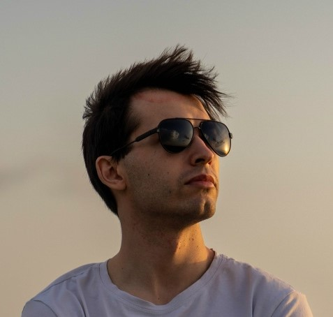

# Данила Щекарев
## Senior Unity Developer
  
shekarev-danil@mail.ru · [GitHub](https://github.com/DanilShekarev) · [Telegram](https://t.me/DanilSheka)

## Навыки

- Языки: C#, C++, Python
- Движки / технологии: Unity, URP, SRP, DOTS
- Инструменты: Git, Notion, RenderDoc
- Работа с графикой: Shader Graph, Compute Shader, HLSL
- Мультиплеер: Mirror, Photon
- Дополнительно: алгоритмы, архитектура, оптимизация, обучаемость

---

## О себе

Senior Unity Developer / Tech Lead с опытом разработки мобильных игр, графических решений и оптимизации под слабые устройства. Сильные стороны: архитектура, производительность, Unity rendering pipeline, mentoring команды и разработка технологий под реальные production-ограничения.

---

## Ключевые достижения

- Участвовал в разработке мобильной игры, вошедшей в топ-10 App Store.
- Разрабатывал кастомные графические решения и собственный SRP для low-end устройств.
- Вёл и обучал junior-разработчиков, участвовал в развитии команды и технических решений.

---

## Опыт работы

### NDA — Студия разработки мобильных игр
**Tech Lead**  
**Июль 2021 — настоящее время**

- Разработка мобильных игр с нуля в команде.
- Проектирование и внедрение новых технологий под production-задачи.
- Оптимизация под слабые устройства и мобильные ограничения.
- Поддержка legacy-проектов.
- Менторинг junior-разработчиков: code review, архитектура, best practices Unity.
- Разработка кастомных графических решений.
- Глубокая работа с Built-in Render Pipeline.
- Разработка собственного SRP для максимальной производительности на low-end устройствах.

---

## Дополнительная информация

- Языки: русский - родной, английский - чтение тех документации.
- Готовность к релокации: нет.
- Формат работы: удалённо, возможны командировки.